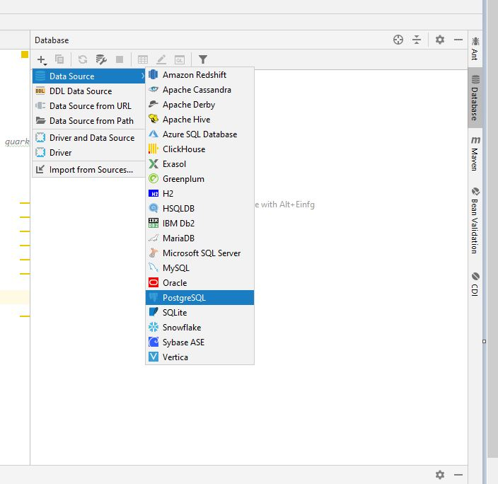

= Übung 03 - Quarkus-Panache - Nenad Tripi&#x0107;
:toc:
:toc-title: Contents
:toclevels: 3

ifdef::env-github[]
:tip-caption: :bulb:
:note-caption: :information_source:
:important-caption: :heavy_exclamation_mark:
:caution-caption: :fire:
:warning-caption: :warning:
endif::[]

:source-highlighter: coderay

== 01. Panache
=== Preperation
==== Quarkus
* Create the quarkus project:
....
 $mvn io.quarkus:quarkus-maven-plugin:0.11.0:create \
        -DprojectGroupId=at.htl.vehicleShop \
        -DprojectArtifactId=quarkus-panache-vehicleShop \
        -DclassName="at.htl.vehicleShop.vehicleShopResource" \
        -Dpath="vehicle"
....

* Adding needed dependencies to link:\quarkus-panache-vehicleShop\pom.xml[pom.xml]
....
<dependency>
      <groupId>io.quarkus</groupId>
      <artifactId>quarkus-hibernate-orm-panache</artifactId>
</dependency>
<dependency>
      <groupId>io.quarkus</groupId>
      <artifactId>quarkus-jdbc-postgresql</artifactId>
</dependency>
....

==== Database

* Creating/Starting of the Postgres database:
....
docker run --name some-postgres -p 5432:5432 -e POSTGRES_PASSWORD=passme -d postgres
....

* Editing the  link:quarkus-panache-vehicleShop\src\main\resources\META-INF\microprofile-config.properties[Configurationsfile] in order to persist entities:
....
# datasource
#                                       docker-IP-Adresse:Port/postgres
quarkus.datasource.url=jdbc:postgresql://192.168.99.100:5432/postgres
quarkus.datasource.driver=org.postgresql.Driver
quarkus.datasource.username=postgres
quarkus.datasource.password=passme
quarkus.datasource.min-size=3
quarkus.datasource.max-size=13

# database configs
quarkus.hibernate-orm.database.generation=drop-and-create
....

* Adding the datasource via the IDE:

image::images/Database_Connection_02.jpg[]

=== Implementiation of the microproject

==== InitBean
Implementation of link:quarkus-panache-vehicleShop\src\main\java\at\htl\vehicleShop\business\InitBean.java[InitBean.java]

TIP: The EntityManager is not necessary anymore. <PanacheEntity-Object>.persist();
....
Product innocent_greensmoothie = new Product("Green Smoothie", 2.26, LocalDate.parse("19.12.2018",formatter), "Innocent",10,store);
innocent_greensmoothie.persist();
....

==== Panache Entities
TIP: Source: https://quarkus.io/guides/hibernate-orm-panache

===== Example PanacheEntity "Vehicle":
....
@NamedQuery(name = "Vehicle.findAll",query = "select v from Vehicle v")
public abstract class Vehicle extends PanacheEntity {

    @Id
    @GeneratedValue(strategy = GenerationType.IDENTITY)
    private Long Id;
    public String manufacturer;
    public String modelName;

    //region Constructor
    public Vehicle() {
    }

    public Vehicle(String manufacturer, String modelName) {
        this.manufacturer = manufacturer;
        this.modelName = modelName;
    }
    //endregion

    @Override
    public String toString() {
        return manufacturer+" "+modelName;
    }
}
....

IMPORTANT: When using Panache you shall not use Getter and Setters instead make the fields public. If you want to manipulate the data when using the Getter (e.g. .toUpperCase) the use properties.

===== Inheritance with Panache

The Baseclass should extend PanacheEntity if all classes which extend the baseclasse should be a PanacheEntity as well.
....
@Entity
@NamedQuery(name = "Sedan.findAll",query = "SELECT s FROM Sedan s")
public class Sedan extends Vehicle {

    public int maxNumOfPassengers;
    public int horsepower;
....

Sedan will be persisted!

==== SQL - Request with Panache
....
System.err.println("------Print SEDANS------");
PanacheQuery<Sedan> sedanQuery = Sedan.findAll();
sedanQuery.list().forEach(s -> System.err.println(s.toString()));
....

IMPORTANT: According to this link:https://stackoverflow.com/a/23083900[StackOverflow-Answer] it is *IMPORTANT* to write the first letter of the tablename with a capitalletter the rest should be smallcaps.

=== Starting the Microproject
....
%mvn% compile quarkus:dev
....

//==== CLD and ERD of the Panache-project
// image::quarkus-panache-supermarket/Klassendiagramm.png[]
//image::quarkus-panache-supermarket/ERD.png[]
