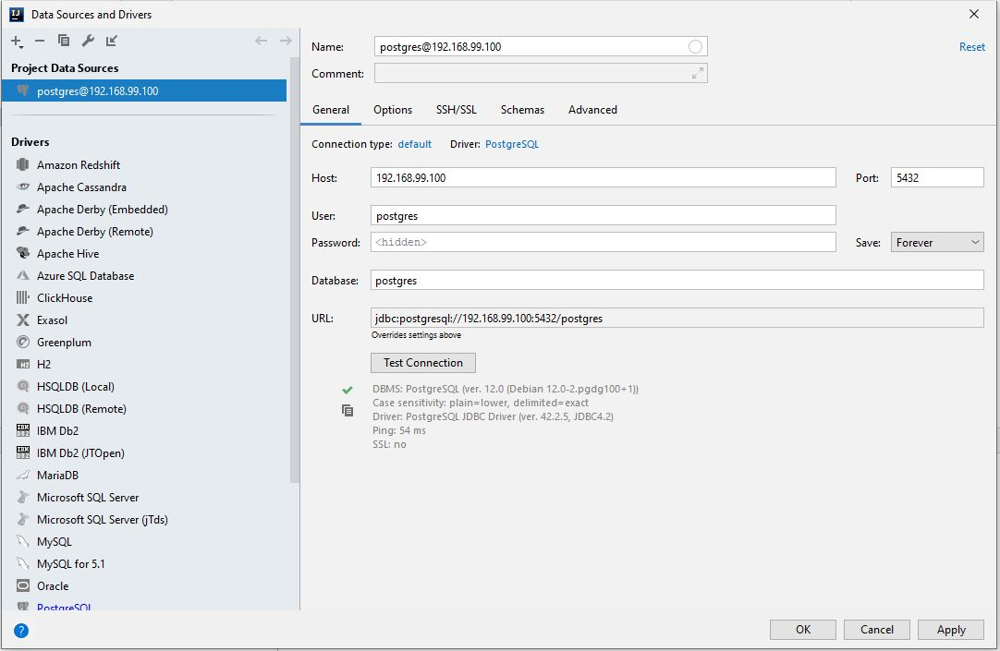
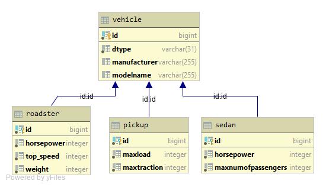

= Homework 03 - Quarkus-Panache/Hibernate - Nenad Tripi&#x0107;
:toc:
:toc-title: Table of contents
:toclevels: 3

ifdef::env-github[]
:tip-caption: :bulb:
:note-caption: :information_source:
:important-caption: :heavy_exclamation_mark:
:caution-caption: :fire:
:warning-caption: :warning:
endif::[]

:source-highlighter: coderay

== 00. Project description
With this miniproject I am implementing a simple vehicleshop. This vehicleshop contains several vehicles of different types. The Vehicle is the baseclasse and all other type of cars inherit from it. This project is rather small and not very enormous but should be considerd as a valid project just to implement the mandatory things and gain some experience.

== 01. Panache
=== Preperation
==== Quarkus
* Create the quarkus project:
....
 $mvn io.quarkus:quarkus-maven-plugin:1.0.1.Final:create\
        -DprojectGroupId=at.htl.vehicleShop \
        -DprojectArtifactId=quarkus-panache-vehicleShop \
        -DclassName="at.htl.vehicleShop.vehicleShopResource" \
        -Dpath="vehicle"
....

* Adding needed dependencies to link:\quarkus-panache-vehicleShop\pom.xml[pom.xml]
....
<dependency>
      <groupId>io.quarkus</groupId>
      <artifactId>quarkus-hibernate-orm-panache</artifactId>
</dependency>
<dependency>
      <groupId>io.quarkus</groupId>
      <artifactId>quarkus-jdbc-postgresql</artifactId>
</dependency>
....

==== Database

* Creating/Starting of the Postgres database:
....
docker run --name some-postgres -p 5432:5432 -e POSTGRES_PASSWORD=passme -d postgres
....

* Editing the  link:quarkus-panache-vehicleShop\src\main\resources\META-INF\microprofile-config.properties[Configurationsfile] in order to persist entities:
....
# datasource
#                                       docker-IP-Adresse:Port/postgres
quarkus.datasource.url=jdbc:postgresql://192.168.99.100:5432/postgres
quarkus.datasource.driver=org.postgresql.Driver
quarkus.datasource.username=postgres
quarkus.datasource.password=passme
quarkus.datasource.min-size=3
quarkus.datasource.max-size=13

# database configs
quarkus.hibernate-orm.database.generation=drop-and-create
....

* Adding the datasource via the IDE:

image::images/Database_Connection_01.jpg[]

=== Implementiation of the microproject

==== InitBean
Implementation of link:quarkus-panache-vehicleShop\src\main\java\at\htl\vehicleShop\business\InitBean.java[InitBean.java]

TIP: The EntityManager is not necessary anymore. <PanacheEntity-Object>.persist();
....
Sedan sedan = new Sedan("BMW", i + "D", 5, i);
sedan.persist();
....

TIP: link:https://quarkus.io/guides/hibernate-orm-panache#transactions[@Transactional]

==== Panache Entities
TIP: Source: https://quarkus.io/guides/hibernate-orm-panache

===== Example PanacheEntity "Vehicle":
....
@Entity
@Inheritance(strategy = InheritanceType.JOINED)
@DiscriminatorColumn
@NamedQuery(name = "Vehicle.findAll",query = "select v from Vehicle v")
public abstract class Vehicle extends PanacheEntity {
    
    public String manufacturer;
    public String modelName;

    //region Constructor
    public Vehicle() {
    }

    public Vehicle(String manufacturer, String modelName) {
        this.manufacturer = manufacturer;
        this.modelName = modelName;
    }
    //endregion

    @Override
    public String toString() {
        return manufacturer+" "+modelName;
    }
}
....

IMPORTANT: When using Panache you shall not use Getter and Setters instead make the fields public. If you want to manipulate the data when using the Getter (e.g. .toUpperCase) the use properties.

IMPORTANT: When using Panache you do not have to make yourself the Id property. Panache automatically implements this for you.

===== Inheritance with Panache

The Baseclass should extend PanacheEntity if all classes which extend the baseclasse should be a PanacheEntity as well.
....
@Entity
@NamedQuery(name = "Sedan.findAll",query = "SELECT s FROM Sedan s")
public class Sedan extends Vehicle {

    public int maxNumOfPassengers;
    public int horsepower;
....

Sedan will be persisted!

==== SQL - Request with Panache
....
System.err.println("------Print SEDANS------");
PanacheQuery<Sedan> sedanQuery = Sedan.findAll();
sedanQuery.list().forEach(s -> System.err.println(s.toString()));
....

IMPORTANT: According to this link:https://stackoverflow.com/a/23083900[StackOverflow-Answer] it is *IMPORTANT* to write the first letter of the tablename with a capitalletter the rest should be smallcaps.

=== Starting the Microproject
....
%mvn% compile quarkus:dev
....

==== CLD and ERD of the Panache-project

== 02. Hibernate
=== Preparation
==== Quarkus
* Create Quarkus-Project with:
....
  $mvn io.quarkus:quarkus-maven-plugin:0.11.0:create \
        -DprojectGroupId=at.htl.vehicleShop \
        -DprojectArtifactId=quarkus-hibernate-vehicleShop \
        -DclassName="at.htl.vehicleShop.vehicleShopResource" \
        -Dpath="vehicle"
....

* Adding the necessary dependencies 
link:\quarkus-hibernate-vehicleShop\pom.xml[pom.xml]
....
<dependency>
    <groupId>io.quarkus</groupId>
    <artifactId>quarkus-hibernate-orm</artifactId>
</dependency>
<dependency>
      <groupId>io.quarkus</groupId>
      <artifactId>quarkus-jdbc-postgresql</artifactId>
</dependency>
....

==== Database (same as 01. Panache)
* Create/Start of postgres database:
....
docker run --name some-postgres -p 5432:5432 -e POSTGRES_PASSWORD=passme -d postgres
....

* For persistence edit the link:quarkus-hibernate-vehicleShop\src\main\resources\META-INF\microprofile-config.properties[configurationsfile].

* Datasource in the IDE

=== Implementation of the microproject
TIP: Source: https://quarkus.io/guides/hibernate-orm

==== InitBean
Implementation of link:quarkus-hibernate-vehicleShop\src\main\java\at\htl\vehicleShop\business\InitBean.java[InitBean.java]

IMPORTANT: Here you must use an EntityManager <EntityManager>.persist(<Entity>); And must include link:https://quarkus.io/guides/hibernate-orm[@Transactional]

....
@ApplicationScoped
public class InitBean {

    @Inject
    EntityManager em;

    @Transactional
    void init(@Observes StartupEvent ev)
    {
        System.err.println("* Init started! *");
        //Creation of objects to persist
    }
}
....

==== Entities
===== Example Entity "Vehicle":
CAUTION: You have to implement a field for the ID and use getter and setter unlike in panache.
....
@Entity
@Inheritance(strategy = InheritanceType.JOINED)
@DiscriminatorColumn
@NamedQuery(name = "Vehicle.findAll", query = "select v from Vehicle v")
public abstract class Vehicle {

    @Id
    @GeneratedValue(strategy = GenerationType.IDENTITY)
    private Long Id;
    private String manufacturer;
    private String modelName;

    //region Constructor
    public Vehicle() {
    }

    public Vehicle(String manufacturer, String modelName) {
        this.manufacturer = manufacturer;
        this.modelName = modelName;
    }

    //endregion
    //region Getter and Setter
....

==== SQL - Query with hibernate
===== Get all sedans
* NamedQuery in the Class:
....
@Entity
@NamedQuery(name = "Sedan.findAll", query = "select s from Sedan s")
public class Sedan extends Vehicle {
....
* Use query:
....
System.err.println("------Print SEDANS------");
        TypedQuery<Sedan> sedanQuery =
                em.createNamedQuery("Sedan.findAll", Sedan.class);
        List<Sedan> sedanQueryResultList = sedanQuery.getResultList();
        sedanQueryResultList.forEach(sedan -> System.err.println(sedan.toString()));
....
* Prints:
....
------Print SEDANS------
BMW 120D, max. Passagiere:5, PS:120
BMW 220D, max. Passagiere:5, PS:220
BMW 320D, max. Passagiere:5, PS:320
BMW 420D, max. Passagiere:5, PS:420
BMW 520D, max. Passagiere:5, PS:520
BMW 620D, max. Passagiere:5, PS:620
BMW 720D, max. Passagiere:5, PS:720
BMW 820D, max. Passagiere:5, PS:820
....
IMPORTANT: This output shows that the inheritance is working as expected. The manufacturer and model are fields from the baseclass vehicle. *No JOIN is needed*.

=== Starting the project (in the same directory)
....
%mvn% compile quarkus:dev
....

==== CLD and ERD of Hibernate-project
The same as in panache above.

== 03. Conclusion: Panache vs. Hibernate
The projects I made are rather small and not really much to process or anything. That is why I am only going to compare the given technologies based on their simplicity.

==== Panache Pros:

* No ID field is needed - does it for you in the background
* SQL Statements are much easier because you do not need an EM anymore
** e.g.: <Entity>.findAll() and <Entity>.find()
* EntityManager is not needed anymore
* My opinion: it is easier to understand

==== Panache Cons:
* Little to none documentation
* Maybe not so far like hibernate
* Easier to learn
* When you have troubles you can not really look up on the internet because it is not commonly used

== 04. User stories - CRUD Operations
TIP: Make sure you add following dependency to be able to use @Produces(MediaType.APPLICATION_JSON). Check this before testing otherwise it will not work probably.

....
    <dependency>
      <groupId>io.quarkus</groupId>
      <artifactId>quarkus-resteasy-jsonb</artifactId>
    </dependency>
....

=== UC_001 Get all vehicles
As an user I want to see all of the persisted vehicles.

Correspoding curl statement would be:
....
curl -H "Accept: application/json" localhost:8080/api/vehicle
....

Or in the browser simply:
....
localhost:8080/api/vehicle
....

=== UC_002 Get vehicle by ID
As an user I want to get a specific persisted vehicle via its ID.

WARNING: Make sure the ID really exists!

Correspoding curl statement would be:
....
curl -H "Accept: application/json" localhost:8080/api/vehicle/2
....

Or in the browser simply:
....
localhost:8080/api/vehicle/2
....

=== UC_003 Delete sedan by ID
As an user I want to delete a sedan this time via its ID.

WARNING: Make sure the ID really exists!

Correspoding curl statement would be:
....
curl -X DELETE "localhost:8080/api/sedan/6" -H "accept: application/json"
....

Do the same with any REST-Tool and a DELETE:
....
localhost:8080/api/sedan/6
....

== 05. Testing the database

TIP: Source: https://assertj.github.io/doc

=== Preperation
==== Maven
* Adding the needed dependencies link:\quarkus-panache-vehicleShop\pom.xml[pom.xml]
....
<dependency>
  <groupId>org.assertj</groupId>
  <artifactId>assertj-core</artifactId>
  <!-- use 2.9.1 for Java 7 projects -->
  <version>3.14.0</version>
  <scope>test</scope>
</dependency>
....

== 06. OpenAPI & Swagger
This creates a description of all the endpoints automatically.

* Adding the needed dependency link:\quarkus-hibernate-vehicleShop\pom.xml[pom.xml]

....
<dependency>
    <groupId>io.quarkus</groupId>
    <artifactId>quarkus-smallrye-openapi</artifactId>
</dependency>
....

* Add this to the link:quarkus-hibernate-vehicleShop\src\main\resources\META-INF\microprofile-config.properties[configurationfile].

....
#OpenApi & Swagger
#OpenAPI: http://localhost:8080/openapi
#Swagger-UI: http://localhost:8080/swagger-ui/#/
quarkus.swagger-ui.always-include=true
....

